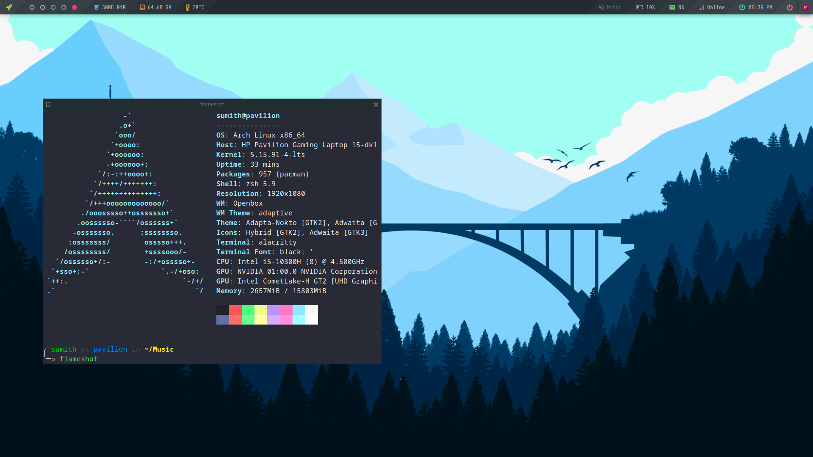

# Easy Openbox Window Manager

It is a simple script that will install Openbox Window Manager.

<br>



## How to install (Automatic)

--Experimental--
This is only for arch linux distro's

```bash
bash setup.sh --install
```

## How to install (Manual)

Installing Openbox

On Arch based distros, use the following command:

<!-- 
```bash
sudo apt install bc bmon calc calcurse curl dbus desktop-file-utils elinks \
feh geany alacritty gedit scrot ranger alsamixer git gtk2 gtk3 htop-legacy \
imagemagick  jq leafpad man mpc mpd mutt ncmpcpp ncurses-utils neofetch netsurf \
obconf openbox openssl polybar ranger rofi startup-notification thunar \
tigervnc vim wget xarchiver xbitmaps xcompmgr xfce4-settings xfce4-terminal \
xmlstarlet xorg-font-util xorg-xrdb zsh
``` -->

<!-- For Fedora:

sudo dnf install openbox obconf

For OpenSUSE:

sudo zypper install openbox obconf

For Arch Linux, use the following:

sudo pacman -S xorg-xdm openbox xorg obconf -->

- Install required dependencies

```bash
sudo pacman -S  xorg xorg-font-util xorg-xrdb xorg-xdm  xorg-server xorg-xinit sxhkd \
xfce4-settings xfce4-terminal polybar ranger rofi startup-notification thunar   \
openbox   obconf xarchiver dbus desktop-file-utils elinks gtk2 gtk3 man flameshot \
zsh git  vim nano curl wget jq xarchiver firefox imagemagick geany alacritty gedit \
bc bmon calc calcurse feh htop scrot mpc mpd mutt ncmpcpp neofetch  openssl leafpad \
xmlstarlet xbitmaps ranger  xcompmgr nitrogen brightnessctl alsa-utils imv maim mpv 
```

>Note: I'm using Arch Linux for this tutorial. However, the below commands and steps will be same for other arch linux distros.

- Clone this repository

```bash
cd ~/
git clone https://github.com/sumithemmadi/EasyOpenboxWM.git
cd EasyOpenboxWM
```

- First you need to backup your `.config` or `dotfiles` run  below command in the same directory (`EasyOpenboxWM`).
- If you don't want any backup, you can ignore this part.

```bash
 configs=($(ls -A $(pwd)/files))
  for file in "${configs[@]}"; do
   if [[ -f "$HOME/$file" || -d "$HOME/$file" ]]; then
    { mv -u ${HOME}/${file}{,.old}; }  
   fi
  done
```

- Run below command to install open box config files.

```bash
 configs=($(ls -A $(pwd)/files))
 for _config in "${configs[@]}"; do
   cp -rf $(pwd)/files/$_config $HOME;
 done
```

- And wait for some time untill installation is done.

## Initialize And Start Openbox


Add openbox to the `.xinitrc` file:

```bash
echo “exec openbox-session” > ~/.xinitrc
```

Start Openbox Window Manager:

```bash
startx
```

### Keybindings

Here's some shortcut keys you want to use to speed up your work. For more, `Right click on desktop > Keybinds`

|Keys|Action| ----- |Keys|Action|
|--|--|--|--|--|
| `W-1` | Go To Desktop 1 |  |`S-W-1` | Send To Desktop 1 |
| `W-2` | Go To Desktop 2 |  |`S-W-2` | Send To Desktop 2 |
| `W-3` | Go To Desktop 3 |  |`S-W-3` | Send To Desktop 3 |
| `W-4` | Go To Desktop 4 |  |`S-W-4` | Send To Desktop 4 |
| `W-5` | Go To Desktop 5 |  |`S-W-5` | Send To Desktop 5 |
||||||
| `W-S-Left` | Send To Prev Desktop |  | `W-S-Right` | Send To Next Desktop |
| `A-Tab` | Next Window (Current Workspace) |  |`W-Tab` | Next Window (All Workspaces) |
||||||
| `W-h` | Move to TopLeft |  | `W-j` | Move to BottomLeft |
| `W-k` | Move to TopRight |  | `W-l` | Move to BottomRight |
| `W-Left` | Move To Left Edge |  | `W-Right` | Move To Right Edge |
| `W-Up` | Maximized |  | `W-Down` | Unmaximized |
||||||
| `W-q/c` | Close Windows |  | `A-r/m` | Toggle Resize/Move |
| `W-Space` | Openbox Menu |  | `W-p/A-F1` | App Launcher |
| `W-d` | Toggle Desktop |  | `W-v` | Set Tasks |
||||||
| `W-f` | File Manager |  | `W-e` | Text Editor |
| `W-t/return` | Terminal |  | `W-w` | Web Browser |
| `W-x` | Exit Menu |  | `W-m` | Music Menu |
| `W-b` | Battery Menu |  | `W-n` | Network Menu |
| `C-A-v` | Vim |  | `C-A-r` | Ranger |
| `C-A-h` | Htop |  | `C-A-n` | Nano |

### Additional Tools

#### Install Paru AUR helper in Arch Linux, EndeavourOS, Manjaro Linux

Installing Paru in Arch Linux is easy!

1. First, install git and base-devel package group that includes tools needed for building (compiling and linking) packages from source.

```bash
sudo pacman -S --needed git base-devel
```

2. Git clone Paru repository using command:

```bash
git clone https://aur.archlinux.org/paru-bin.git
```

This command will download the contents of the Paru GitHub repository in a local directory named paru.

3. Change into the paru directory:

```bash
cd paru-bin
```

4. Finally, build and install Paru AUR helper in Arch Linux using the following command:

```bash
makepkg -sri
```

You can use `paru` for install packages from [AUR](https://aur.archlinux.org/paru.git)

#### oh-my-zsh

1. Setup zsh with [oh-my-zsh](https://github.com/robbyrussell/oh-my-zsh) framework.

```bash
paru -S oh-my-zsh-git oh-my-zsh-plugin-syntax-highlighting oh-my-zsh-plugin-autosuggestions
```

#### Additional Information

- Edit ~/.local/bin/email and put your Email ID and Password (Use an App password) to show unread mails on polybar.
- You may need to edit some config files accoring to your need (~/.mutt/muttrc)
